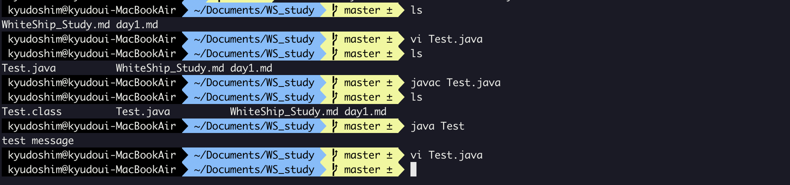

### 자바 소스 파일(.java)을 JVM으로 실행하는 과정 이해하기

학습할 것

---

### JVM이란 무엇인가?

- JVM(Java Virtual Machine) 
  - Java로 개발한 프로그램을 컴파일하게되면 만들어지는 바이트코드를 OS에 맞게 해석하여 실행시키기 위한 가상 머신
  - Java Compiler는 .java파일을 .class라는 Java 바이트코드로 변환시킨다. 여기서 바이트코드는 기계어가 아니기 때문에 OS에서 바로 실행되지 않는다. 여기서 JVM은 OS가 바이트코드를 이해할 수 있도록 해석해주는 역할
  - 위의 설명들을 합쳐보면 바이트코드는 JVM위에서 OS에 관계없이 실행되게준다.
    - JVM은 플랫폼 독립적으로, JVM이 실행 가능한 환경이라면 어디서든 Java 프로그램이 실행될 수 있도록 한다.
  - JVM의 역활은 자바 애플리케이션을 Class Loader를 통해 읽어들여 자바 API와 함께 실행하는 것이다.  
    - Class Loader : 런타임시에 클래스를 로딩하게 해주며, 클래스의 인스턴스를 생성하면 메모리에 로드시켜줌
  - 즉 java와 os사이에서의 중개자 역할을 수행하며 os에 구애받지 않고 재사용이 가능하게 해준다.
  - 스택기반의 가상머신이다

---

### Java 컴파일, 실행하기

컴파일 : 어떤 언어로 된 소스 코드를 기계가 인식할 수 있는 네이티브 코드로 변환하는 과정을 의미한다.

자바에서의 컴파일 : 자바 언어로된 코드를 JVM이 인식할 수 있는 JVM명령어 코드(바이트코드)로 변환하는 것을 의미함

우선은 자바 컴파일러가 들어있는 JDK를 설치되어있어야 한다.
직접 해보는 과정

- vi편집기를 통해서 Test.java 파일을 생성 
- javac Test.java 를 통해서 컴파일
  - javac 파일명
- 위의 단계를 거치게 되면 컴파일 되어, Test.class파일이 생김(.class는 컴파일되서 생성된 실행파일이다.)
- java파일의 실행을 위해서 java Test 실행
  - java 파일명
- 이렇게 실행이 된다.

컴파일 과정

1. 전처리(Pre-processing) -> 주석 제거, 매크로 인라인화, Include 파일 인라인화
2. 컴파일(Compiling) -> 컴파일러가 전처리 과정을 거친 C 소스 코드를 컴파일해서 어셈블리어 코드로 변환
3. 어셈블리(Assembly) -> 어셈블러가 어셈블리어 코드를 기계어 코드로 변환
4. 링크(Linking) -> 링커가 기계어 코드와 공유 라이브러리 등 다든 코드를 합쳐서 최종 실행파일을 생성

---

### 자바 바이트코드 : 가상 컴퓨터에서 돌아가는 실행 프로그램을 위한 이진 표현법

- JVM이 실행하는 명령어의 형태
- 자바 컴파일러에 의해서 변환되는 코드의 명령어 크기가 1바이트라서 자바 바이트코드라고 불리움
- 생성된 확장자는 .class
- 바이트코드는 JVM만 설치되어 있다면 어떤 운영체제에서라도 실행될 수 있음

---

### JIT Compiler

- 프로그램을 실제 실행하는 시점에 실시간으로 기계어로 번역하는 컴파일 기법

- JRE안에(=JVM안에) 존재

- 왜 사용할까?

  같은 코드를 매번 해석하지 않고 실행할 때 컴파일을 하면서 해당 코드를 캐싱한다. 다음으로는 바뀐 부분만 컴파일하고 나머지는 캐싱된 코드를 사용한다. => 인터프리터의 속도를 개선하는 것이 가능하다.

---

### JVM의 구성요소

---

### JDK과 JRE의 차이

#### JRE(Java Runtime Environment)

- 자바 파일을 JVM으로 로딩시키는 역할
- JVM은 자바파일을 해석해서 실행할 수 있는 상태로 만들어준다.
- jre는 자바 프로그램이 실행되기 위한 최소환경 = java파일을 실행만 시킬 것이라면 jre만 있어도 가능하다.
- runtine environment은 다른 소프트웨어를 실행하기 위해 고안되는 일종의 소프트웨어임

#### JDK(Java Developement Kit)

- 자바 환경에서 돌아가는 프로그램을 개발하는 데 필요한 툴들만 모아둔 소프트웨어 패키지

