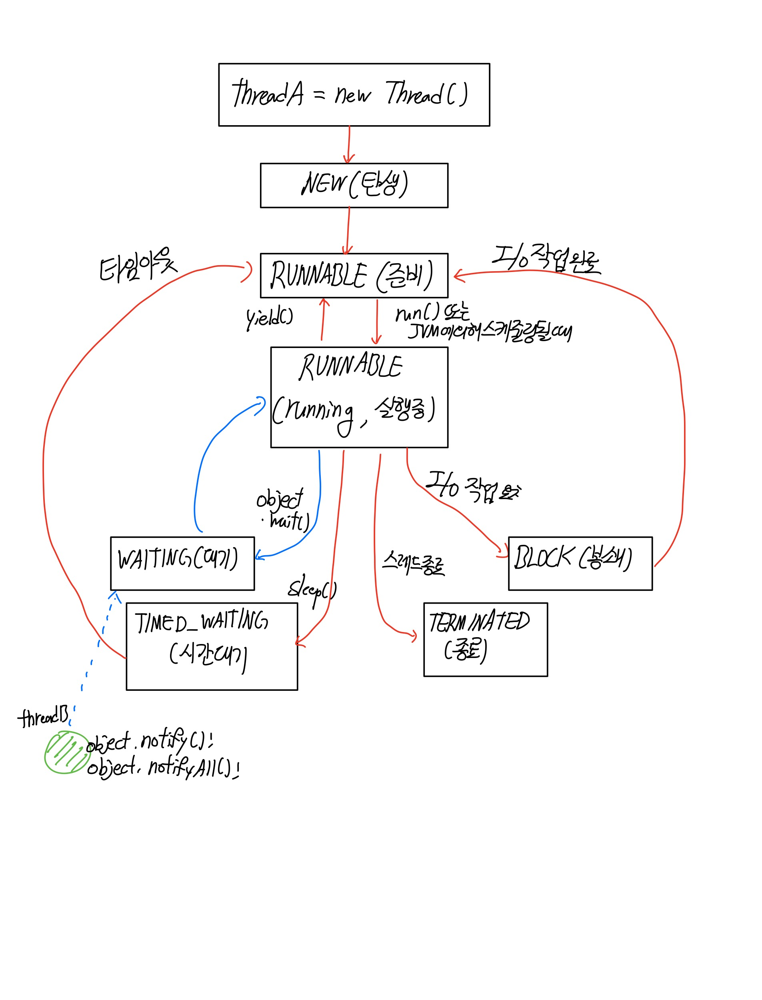

# 10주차 과제 : 멀티쓰레드 프로그래밍


### 스레드란

---

스레드(thread)란 직역하면 바느질 할 때 사용하는 '실'이다. 바늘에 꿰어진 하나의실로 하나의 바느질 작업만 할 수 있다.

컴퓨터에서 사용하는 스레드는 thread of control의 준말이다

**하나의 실로 하나의 바느질 밖에 없듯 이, 하나의 스레드로 하나의 작업밖에 처리할 수 없다**


구체적으로 스레드는 운영체제나 JVM에서 태스크를 실행하는 단위로써, 운영체제나 JVM에 의해 관리되는 단위

JVM은 하나의 태스크를 실행하기 위해 하나의 스레드를 만들고, 스레드로 하여금 태스크 코드를 실행하게 한다


### Thread 클래스와 Runnable 인터페이스

---

자바 스레드를 만들기 위해서는 두 가지 작업이 필요하다

- 스레드 코드 작성
- JVM에서 스레드를 생성하고 스레드 코드를 실행하도록 요청


스레드 코드를 작성하는 방법

- Thread 클래스 이용
- Runnable 인터페이스 이용


#### Thread 클래스를 상속받아 스레드 만들기

- Thread 클래스의 경로명은 java.lang.Thread
- Thread 클래스를 상속받아 원하는 스레드 코드를 생성할 수 있다.
- Thread 클래스는 스레드를 만들고 유지 관리하기 위해 다양한 메소드를 제공
  - Thread 생성자
    - Thread() : 스레드 객체 생성
    - Thread(Runnable target) : Runnable객체인 target을 이용하여 thread객체 생성
    - Thread(String name) : 이름이 name인 스레드 객체 생성
    - Thread(Runnable target, String name) : Runnable 객체를 이용하여, 이름이 name인 스레드 객체 생성
  - Thread 메소드
    - void run() : 스레드가 실행할 부분
    - void start() : JVM에서 스레드 실행을 시작하도록 요청
    - void interrup() : 스레드 강제 종료
    - static void yield() : 다른 스레드에게 실행을 양보
    - void join() : 스레드가 종료할 때까지 기다림
    - long getId() : 스레드의 ID값 리턴
    - String getName() : 스레드의 이름 리턴
    - int getPriority() : 스레드의 우선순위값 리턴 ( 1- 10 사이)
    - void setPriority(int n) : 스레드의 우선순위 값을 n으로 변경
    - Thread.State getState() : 스레드의 상태 값 리턴
    - static void sleep(long mills) : 스레드는 mills 시간 동안 잔다. mills의 단위는 밀리초
    - static Thread currentThread() : 현재 실행중인 스레드 객체와 래퍼런스 리턴


Thread 클래스 작성 

```java
class TimerThread extends Thread{
  @Override
	public void run(){
    //실행할 것을 기술
  }
}

//사용
TimerThread th = new TimerThread();
th.start();
```

- Thread 클래스 상속
  - extends 키워드를 사용해서 상속
- run() 메소드 오버라이딩
  - run() 메소드에 작성된 코드를 스레드 코드라고 부른다.
  - 스레드는 run()에서부터 실행을 시작하고 run()이 종료하면 스레드도 종료한다.
  - run()을 오버라이딩 하지 않는다면 Thread클래스에 작성된 run()이 실행되며 run()은 아무런 일도 하지 않고 단순히 리턴하도록 작성되어있기 때문에 스레드가 바로 종료

- 스레드 객체 생성

  - 스레드 객체의 생성은 그냥 객체의 생성에 불과함
  - 스레드는 다른 객체와는 다르게 JVM에 등록되어 JVM에 의해 스케쥴링 되어야 비로소 작동

- 스레드의 시작 : start() 메소드 호출

  - Thread 클래스의 start() 메소드를 호출
  - start() 메소드는 Thread에 구현된 메소드이며 개발자가 오버라이딩 하면 안된다
  - start()메소드는 생성된 스레드 객체를 스케쥴링이 가능한 상태로 전환하도록 JVM에게 지시한다
  - 이후 스케쥴링에 의해 이 스레드가 선택되면 비로소 JVM에 의해 run() 메소드가 호출되어 실행을 시작

  

#### Runnable 인터페이스로 스레드 만들기

Runnable은 클래스가 아닌 인터페이스로써 경로명 java.lang.Runnable이며, 다음과 같이 추상 메소드를 run()하나만 가지고 있다.

```java
interface Runnable{
	public void run();
}
```


아래는 Runnable 인터페이스의 run()을 구현한 TimerRunnable 클래스를 작성하고 스레드를 생성하는 코드임.

```java
class TimerRunnable implements Runnable{
	int n = 0;
	@Override
	public void run(){
		while(true){
			System.out.println(n);
			n++;
			try{
				Thread.sleep(1000);
			}
			catch(InterruptedException e){
				return;
			}
		}
	}
}

//사용
Thread th = new Thread(new TimerRunnable());
th.start();
```

- Runnable 인터페이스 구현
  - implements로 받아서 사용
- run() 메소드 오버라이딩
  - run()메소드는 스레드 코드이며 run()이 종료되면 스레드도 종료된다
- 스레드 객체 생성
  - Thread th = new Thread(new TimerRunnable());

- start() 메소드 호출
  - th.start()는 생성된 스레드 객체 th를 스케쥴링이 가능한 상태로 전환하도록 JVM에게 지시하고 이후 JVM에 의해 이 스레드가 선택되면 이 스레드의 run() 메소드가 호출되고 실행


### 스레드의 상태

---

스레드는 생명 주기를 가진다 그리고 그 생명 주기 동안 여러 상태의 변이를 거친다.

스레드의 상태는 총 6가지이며 JVM에 의해서 관리된다





- NEW : 스레드가 생성되었지만 아직 실행할 준비가 되지 않은 상태이다. start() 메소드가 호출되면 RUNNABLE 상태가 된다
- RUNNABLE : 스레드가 현재 실행되고 있거나 실행 준비되어 스케쥴링을 기다리는 상태
- TIMED_WAITING : 스레드가 sleep(long n)을 호출하여 n밀리초 동안 잠을 자는 상태
- BLOCK : 스레드가 I/O 작업을 실행하고 완료를 기다리면서 멈춘 상태
- WAITING : 스레드가 어떤 객체 a에 대해서 a.wait()을 호출하여 다른 스레드가 a.notify()나 a.notifyAll()을 불러줄 때 까지 무한정 기다리는 상태
- TERMINATED : 스레드가 종료한 상태, 더 이상 다른 상태로 변이할 수 없ㅇ므


스레드의 일생

1. new Thread()에 의해 스레드 객체가 생성되면 JVM은 생성된 스레드 정보를 관리, 생성된 스레드는 NEW 상태이다
   - NEW 상태의 스레드는 스케쥴링되지 않기 때문에 실행될 수 없는 상태이다. 
   - 스케쥴링이란 JVM이 RUNNABLE(준비) 상태인 스레드 중에서 하나를 선택하여 실행시키는 과정
2. Thread 클래스의 start() 메소드가 호출되면 스레드는 비로소 실행될 수 있는 RUNNABLE(준비) 상태가 된다. 
   - JVM은 RUNNABLE상태에 있는 스레드 중에서 하나를 선택, 실행함
   - 처음으로 스케줄링되는 스레드는 run() 메소드의 첫 라인부터 실행을 시작
   - JVM은 스케쥴링 시 우선순위가 높은 스레드를 우선적으로 선택
   - 만약 우선순위가 동일한 스레드가 여러개가 있으면 라운드로빈방식으로 진행
3. 만약 우선 실행 중인 스레드가 I/O 작업을 하게 되면 -> JVM에 의해 즉각 중지되면 BLOCK상태가 된다
   - BLOCK상태의 스레드는 I/O 작업이 완료될 때 까지 스케쥴링 되지 않고 대기함
   - I/O작업이 완료되면 스레드는 자동으로 RUNNABLE 상태가 된다
4. 실행 중인 스레드가 만일 yield()를 호출하면 다른 스레드가 스케쥴링 될 수 있도록 양보하겠다는 의미로, JVM은 현재 실행 중인 스레드를 즉각 RUNNABLE 상태로 변경하고 스케쥴링을 실시한다. 만일 다른 높은 우선순위의 스레드가 없거나 동일한 우선 순위의 다른 스레드가 없으면 이 스레드가 다시 스케쥴링된다
5. 실행 중인 스데르가 sleep(millis)을 호출하면 mills 밀리초 시간만큼 잠을 자게되므로 JVM은 이 스레드를 TIMED_WAITING 상태로 변경하고 스케쥴링을 시작한다. 이 스레드는 millis 밀리초 후 깨어나 RUNNABLE상태가 된다


- 쓰레드의 우선순위
- Main 쓰레드
- 동기화
- 데드락


#### 참고

---

명품 JAVA Programming - 저자 황기태