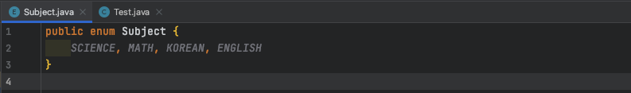

# 11주차 과제 : Enum

### Enum이란?

- 열거체라고 해서 enumeration type이다.
- 클래스처럼 보이게 하는 상수 
  - 상수이기 때문에 equals함수가 아닌 '=='로 비교가 가능하다!!
- 서로 관련 있는 상수들을 모아 심볼릭한 명칭의 집합으로 정의한 것
- Enum 클래스형을 기반으로 한 클래스형 선언
- 새로운 열거형을 선언하면, 내부적으로 Enum 클래스형 기반의 새로운 클래스형이 만들어짐

장점

- 문자열과 비교해서 자동완성, 오타검증, 텍스트 리팩토링 등 여러가지 지원을 받는 것이 가능
- 허용 가능한 값들을 제한할 수 있음
- 열거체를 비교할 떄 실제 값뿐만 아니라 타입까지도 체크
- 열거체의 상숫값이 재정의되더라도 다시 컴파일 할 필요가 없음

### Enum을 정의하는 방법

주의 : enum 열거형으로 지정된 상수는 대문자를 사용하며, 마지막에 ; 을 붙히지 않는다!

1. 하나의 자바 파일로 만들어서 선언

파일 생성할 떄 enum파일 선택하게되면 원래의 class 자리에 enum이 들어감

사용할 때는 

 

Enum으로 정의할 때 사용한 이름(subject) 을 String이나 int와 같은 타입으로 두고 사용

2. 클래스 안에서 선언하기

필요할때 enum 키워드를 사용해서 원하는 요소들을 집어넣어주고 사용

3. 클래스 밖에서 선언하기

   

선언을 하고 나서 사용은 이렇게 한다

데이터 타입처럼 선언하고, enum이름.enum요소 방식으로 넣어서 사용할 수 있다

### enum이 제공하는 메소드

- values() : 모든 enum의 요소들을 배열으로 생성

  - values함수를 이용해서 enum의 요소들을 모두 출력하는 예시

  - 
  - 
- valueOf() : 문자열로 enum 요소의 이름을 찾아서 요소의 이름을 리턴
  - 
  - 
- name() : 호출된 값의 이름을 String으로 리턴
- ordinal() : 해당 값이 enum이 정의된 순서를 정수값으로 리턴
  - 이것은 언제  다른 사람들이 사용할 수도 있기 떄문에 사용을 덜 한다
  - (심지어 찾아보니까 Most programmer들은 사용하지 않는다고 주석으로도 적혀있었다!)
- compareTo(E o ) : enum과 지정된 객체의 순서를 비교, 지정된 객체보다 작은 경우, 음의 정수, 동일하면 0, 크면 양의 정수 리턴
- equals(Object other) : 지정된 객체가 enum 정수와 같은경우, true를 리턴

### java.lang.Enum

Enum 클래스는 모든 자바 열거체의 공통된 조상 클래스

Enum 클래스에는 열거체를 조작하기 위한 다양한 메소드가 있음

유일한 생성자

protected Enum(String name, int ordinal) : 유일한 생성자로 프로그래머는 이 생성자를 호출할 수 없음

열거형 선언에 대한 응답으로 컴파일러에서 내보낸 코드를 사용

### EnumSet

java.util에 존재하며, class EnumSet<E extends Enum<E>>이렇게 선언하면서 사용한다

EnumSet은 열거형 유형과 함게 사용하기 위한 set구현체이다. 

반복하는 메소드에 의해 리턴된 반복기는 열거 형 상수가 선언된 순서로 요소를 순회하며, 리턴된 반복기는 약하게 일관성이 있음

Null 요소는 허용되지 않으며 만약 null 요소를 삽입하려고 하면 NullPointerException이 발생한다. 그러나 null요소가 있는지 테스트하는 단계나 제거하려는 시도는 가능하다

EnumSet은 동기화되지 않는다. 여러 스레드가 동시에 열거형 집합에 접근하고 적어도 하나의 스레드가 집합을 수정하는 경우에 외부에서 동기화되어야 한다.

메소드들

- allOf : 지정된 요소 타입의 모든 요소를 포함하는 enum set을 만듬
- noneOf : 지정된 요소 타입을 사용하여 빈 enum set을 만듬

Type Safety 

tip) 값을 매기고 순서를 정할때는 1,2,3... 이렇게 가는게아니라 10,20,30 이렇게 순서를 매기면 편하다! => 사이에 값을 추가할 일이 생길것이기 때문에!

#### 참고

---

https://docs.oracle.com/javase/8/docs/api/java/util/EnumSet.html

https://www.opentutorials.org/module/1226/8025

https://limkydev.tistory.com/66

https://parkadd.tistory.com/50