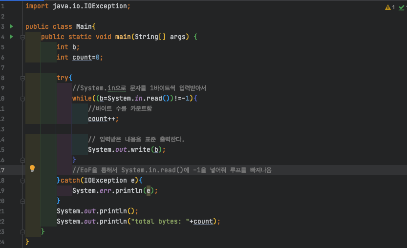
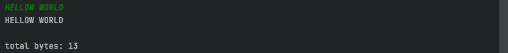
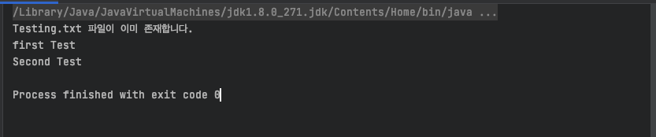
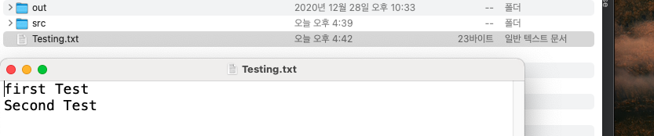

# 13주차 과제 : I/O

### 스트림 (Stream) / 버퍼 (Buffer) / 채널 (Channel) 기반의 I/O

#### 스트림 (Stream)

스트림( Stream )이란 단일 방향으로 연속적으로 흘러가는 것을 의미한다.

**즉, 자료의 입출력을 도와주는 중간 매개체라고 생각하면 되겠다**

데이터를 어떤 방식으로 전달하느냐에 따라서 2가지로 나뉜다

- 바이트 스트림(Byte Stream)
  - 데이터를 Byte 단위로 주고 받는 것을 의미
  - binary 데이터를 입출력하는 스트림
  - 이미지, 동영상등 모든 종류의 데이터들을 송수신할 떄 주로 사용
  - 대표적인 바이트 스트림에는 데이터 입력의 InputStream과 데이터 출력의 OutputStream이 있고 이 두 추상 클래스는 byte기반 stream의 최고 조상이다 
- 문자 스트림 (Character Stream)
  - 문자 단위로 인코딩 처리를 하는 스트림
  - 텍스트 파일등을 송수신할 떄 주로 사용

하지만 이 두 stream은 모두 처음에는 Byte로 받아들이는 것은 동일하다. 그리고 해당 Stream이 알아서 처리를 해준다.


#### 버퍼 (Buffer)

버퍼 (Buffer)란 데이터를 전송하는 상호 간의 장치에서 고속의 장치와 저속의 장치 간의 속도 차이로 인해 저속의 장치가 작업을 추리하는 동안, 고속의 장치가 기다려야하는 현상을 줄여주는 기술이며 **데이터를 임시 저장하는 공간을 의미한다**. 그리고  임시저장장치로 불리운다.


그림으로 버퍼를 사용하는 경우와 사용하지 않는 경우를 확인해봤다


이렇게 버퍼를 사용하면, 운영체제의 API 호출 횟수를 줄여서 입출력 성능을 개선할 수 있다. 

(알고리즘 문제 풀때 Scanner 방식과 BufferedReader방식이 있었는데 buffer의 개념을 이렇게 알고 나니까 신기했다.)


#### 채널 (Channel)

채널은 한 마디로 서버와 클라이언트간의 통신 수단을 나타낸다. 즉 한 개 이상의 확실한 입출력 작업을 수행할 수 있는 개방된 연결을 나타낸다.

채널은 비동기적으로 닫히고 중단될 수 있기 때문에 한 스레드가 한 채널의 입출력 작업으로 블록화 되면, 다른 스레드가 블록화된 스레드를 중단시킬 수 있다. 그래서 파일입출력에서 블록화된 스레드를 언제나 중지시킬 수 있으며, 이를 통해서 네트워크에서 non-blockin 입출력이 가능해짐

읽, 쓰기를 동시에 할 수 있는 것이 특징이며 채널의 기본 입출력 버퍼는 BtyeBuffer 이기 떄문에 데이터 형에 맞는 전용 메모리 공간을 가지고 있다. 


### InputStream, OutputStream

#### InputStream이란

위에서도 언급했지만 바이트 기반의 입력 스트림의 최상위 클래스(추상 클래스)이다. 그 의미는 모든 바이트 기반 입력 스트림은 이 클래스를 상속받아서 만들어진다.

InputStream 클래스의 메소드들

- int available() : 현재 읽을 수 있는 바이트 수를 반환
- void close() : 현재 열려있는 InputStream을 닫는다
- void mark(int readlimit) : InputStream에서 현재의 위치를 표시
- boolean markSupported() : 해당 InputStream에서 mark()로 지정된 지점이 있는지에 대한 여부를 확인
- abstract int read() : InputStream에서 한 바이트를 읽어서 int 값으로 반환
- int read(byte[] b) : 인자 만큼의 데이터를 읽어서 b에 저장하고 읽은 바이트 수 반환
- int read(byte b, int off, int len) : len만큼 읽어서 b의 off위치에 저장하고 읽은 바이트 수 반환
- void reset() : mark()를 마지막으로 호출한 위치로 이동
- long skip(long n) : InputStream에서 n바이트 만큼 데이터를 스킵하고 바이트 수를 반환


#### OutputStream이란

위에서도 언급했지만 바이트 기반의 입력 스트림의 최상위 클래스(추상 클래스)이다. 그 의미는 모든 바이트 기반 출력 스트림은 이 클래스를 상속받아서 만들어진다.

OutputStream 클래스의 메소드들

- void close() : OutputStream을 닫는다
- void flush() : 버퍼에 남아있는 출력 스트림을 출력
- void write(byte[] b) : 버퍼의 내용을 출력
- void write(byte[] b, int off, int len) : b 배열 안에 있는 시작 off부터 len만큼 출력
- abstract void write(int b) : 정수 b의 하위 1바이트를 출력


### 표준 스트림 (System.in, System.out, System.err)

System 클래스는 실행시간 환경과 관련된 속성과 메소드를 가지고 있다. 

System 클래스에서 제공되는 out과 in을 이용한 표준 입력, 출력, 에러 출력에 관한 클래스 변수, 외부적으로 정의된 프로퍼티 및 환경 변수의 접근, 파일 및 라이브러리의 로딩 방법, 객체를 복사해주는 메소드와 프로그램을 작성할 때 사용할 수 있는 유용한 메소드

#### System.in

System.in 의 변수 타입이 InputStream 형태로 지정이 되어있다. 

위에서 언급했지만 InputStream은 최상위 클래스이면서 추상 클래스이기 때문에 InputStream은 객체를 생성할 수 없는 클래스다

System.in 을 통해서 접근하는 객체는 JVM이 메모리로 올라오면서 미리 객체를 생성해 두는 대표적인 객체이다. 자료형이 InputStream이기 떄문에 바이트 단위로만 입출력된다.

키보드에서 입력하는 자료는 때에 따라서 두 바이트가 합쳐져야 의미를 가지는 경우가 있다. 그래서 System.in을 통해서 읽을 때는 영문과 한글의 처리를 분리해서 구성해야 잘 인식된다.


#### System.out

가장 흔하게 System.out.println으로 사용하면서 본 함수이다

System.out 변수는 표준 출력 장치 객체를 가리키는 대표적인 출력 변수이다.

System.out은 PrintStream 타입으로 되어있는데 여기서 PrintStream이란 OutputStream 클래스의 후손 클래스로 Exception을 안전하게 처리할 메소드로만 구성이 되어있다. 그래서 굳이 try-catch 문 같이 따로 처리를 해주지 않아도 괜찮다


#### System.err

System.err 객체는 표준 에러 출력 장치를 의미한다. 오류가 발생하게 되면 System.err로 알려줘야 하는 내용이 나온다고 생각하면 된다.

System.err 는 PrintStream 클래스 타입으로 System.out을 사용하는 방법과 같다.






### 파일 읽고 쓰기

자바에서 파일을 읽고 쓰는 방법은 자바의 내장 클래스인 FileWriter, BufferedWriter, FileReader, BufferedReader를 사용한다

여기서 파일 쓰기를 위한 BufferedWriter와 FileWriter의 객체를 사용할 때 try-catch의 마지막 finally block에서 null check 및 close()하는 코드를 삽입해 줘야 하는데, 여기서는 java 7에 도입된 try catch with resources을 사용해서 진행해보았다.

이것은 try catch block에서 생성한 객체를 자동으로 close() 해주는 향상된 try catch문법이다

```java
import java.io.*;

public class Main{
    public static void main(String[] args) {
      //파일을 쓰는(없으면 생성)하는 코드
        try(
          //여기서 객체를 생성하게되면 try가 종료되고 나서 자동으로 close된다
                FileWriter fw = new FileWriter("Testing.txt", true);
                BufferedWriter bw = new BufferedWriter(fw);
                )
        {
          //버퍼에 데이터를 넣고
            bw.write("first Test");
          //버퍼에 새로운 줄을 넣어주고
            bw.newLine();
            bw.write("Second Test");
            bw.newLine();
          //버퍼의 내용을 파일에 작성
            bw.flush();
        }catch(IOException e){
            System.out.println(e);
        }

        File f = new File("Testing.txt");
      //파일이 존재하고 있는 지 확인
        if(f.isFile()){
            System.out.println("Testing.txt 파일이 이미 존재합니다.");
        }

      //파일을 읽는 코드
        try(
                FileReader rw = new FileReader("Testing.txt");
                BufferedReader br = new BufferedReader(rw);
                ){
            String readLine = null;
          //만약 읽을라인이 없다면 null을 리턴한다
            while((readLine = br.readLine()) != null){
                System.out.println(readLine);
            }
        }catch (IOException e){
            System.out.println(e);
        }


    }
}
```


위 코드 실행결과




실제 파일이 생성된 것과 내용 확인




### 참고사이트

---

https://victorydntmd.tistory.com/134

https://real-dongsoo7.tistory.com/70

https://m.blog.naver.com/PostView.nhn?blogId=redbird38&logNo=120095618390&proxyReferer=https:%2F%2Fwww.google.com%2F

https://develop-im.tistory.com/54

https://hyeonstorage.tistory.com/235

https://vmpo.tistory.com/63

https://vmpo.tistory.com/entry/java-try-catch-with-resources-예외처리?category=731823