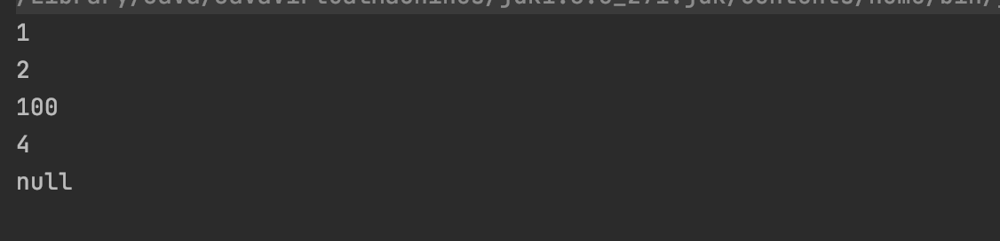

# 14주차 과제 : 제네릭

- 제네릭 사용법
- 제네릭 주요 개념(바운디드 타입, 와일드 카드)
- 제네릭 메소드 만들기
- Erasure


### 제네릭의 기본 개념

제네릭은 모든 종류의 타입을 다룰 수 있도록, 클래스나 메소드의 매개변수(generic type)을 이용하여 선언하는 기법이다. 그리고 본 떠 찍어내기 위해 만들어진 틀이라고 생각하면 편하다. 자바에서의 제네릭은 클래스 코드를 찍어내듯이 생산할 수 있도록 일반화(generic)시키는 도구이다.


#### +제네릭 타입 매개변수

여기서 타입 매개 변수로 사용하는 문자는 다른 변수와 혼동을 피하기 위해 일반적으로 하나의 대문자를 사용

- E : Element을 의미하여 컬렉션에서 요소임을 나타냄
- T : Type을 의미
- V : Value을 의미
- K : Key을 의미


### 제네릭 컬렉션 생성

벡터 생성할 때, **Vector<E>** 의 E에 요소를 사용할 타입을 지정해야 한다. 예를 들어, 정수 값만 삽입 가능한 벡터를 만들고자 하면 다음 과 같이 E에 Integer를 지정하여 사용가능

```java
Vector<Integer> v = new Vector<Integer>();
```

이렇게 데이터의 타입을 넣어줘야하는데

int, char, double 등의 기본 타입은 E에 사용할 수 없다.

```java
Vector<int> v = new Vector<int>();
```

->이렇게 하면 에러가 나게 된다.


```java
Vector<Integer> v = new Vector<Integer>(5);
```

이렇게 초기 용량을 지정할 수 있지만 개발자는 생성된 벡터의 용량을 굳이 알 필요 없다. 컬렉션은 자신의 용량을 스스로 조절하기 때문이다. 이게 또 제네릭의 장점이다


#### Vector E 클래스의 주요된 메소드

- boolean add(E element) 
  - 벡터의 맨 뒤에 element 추가
- void add(int index, E element)
  - 인덱스 index에 element를 삽입
- int capacity()
  - 현재 벡터의 용량을 리턴
- void clear()
  - 벡터의 모든 요소 삭제
- boolean contains(Object o)
  - 벡터가 지정된 객체를 o이 포함하고 있다면 true를 리턴
- E elementAt(int index)
  - index 위치에서의 요소 리턴
- E get(int index)
  - index 위치에서의 요소 리턴
- E remove(int index)
  - index 위치에서의 요소 삭제
- int size()
  - 벡터가 포함되는 요소의 갯수 리턴


#### 벡터의 메소드를 사용하는 예제

벡터에서의 삽입은 벡터의 끝이나 중간에 요소를 삽입할 수 있음

```java
import java.util.Vector;

public class vTest {
    public static void main(String[] args) {
        Vector<Integer> v = new Vector<>();

        //원래는 정수를 Integer 객체를 만들어서 삽입
        v.add(new Integer(1));
        v.add(new Integer(2));

        //자동 박싱 기능을 활용하면 굳이 Integer 객체로 변환되어 삽입될 수 있음
        v.add(3);
        v.add(4);

        //만약 여기에서 다른 객체 타입을 넣을려고 시도하면 에러가 생긴다
//        v.add("hello");
//        v.add(new Double(3,5));

        //벡터에는 null도 삽입할 수 있기 때문에 벡터를 검색할 때 null이 존재할 수도 있음
        v.add(null);

        //원하는 위치에 벡터를 입력하기 위해서는 2개의 인자를 가진 함수사용
        //이렇게 되면 2번째 위치에 100이 들어가게 된다.
        v.add(2, 100);
        //1, 2, 100, 3, 4 여기까지 해두어야함

        //인덱스에 있는 요소를 삭제할 수 있다.
        //벡터에서의 3번째 값이 없어져야하니까 3이 없어져야 한다
        v.remove(3);

        for(int i=0; i<v.size(); i++){
            System.out.println(v.get(i));
        }
    }
}

```




### 참고사이트

---

