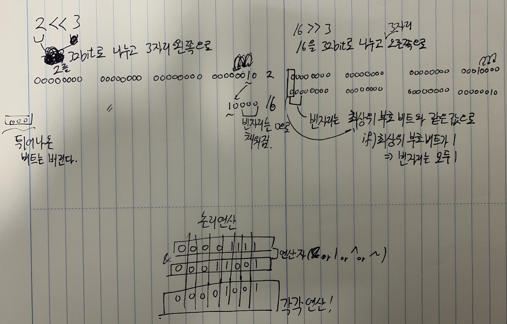

## 3주차 과제 : 연산자

- 산술연산자, 비트연산자, 관계연산자, 논리연산자, instanceof
- assignment(=) operator, 화살표(->)연산자, 3항 연산자, 연산자 우선순위, Java 13, switch연산자


#### 산술 연산자

- 숫자 값을 피연산자로 받아서 하나의 숫자 값을 반환한다. 종류로는 +,-,*,/,% 가 있다.

- 덧셈(+) : 숫자 피연산자를 더한 값, 문자열이면 문자열을 연결한 값

- 뺄셈(-) : 숫자 피연산자를 뺀 값

- 곱셈(*) : 숫자 피연산자를 곱한 값

- 나눗셈(/) : 숫자 피연산자를 나눈 몫

- 나머지값(%) : 숫자 피연산자를 나누고 남은 나머지

  - ```
    형태 : 변수/상수 + 변수/상수 
    public class Main {
        public static void main(String[] args) {
            int a=10, b=5;
            //int+int = int
            System.out.println(a+b);//15
            //String+int = string
            System.out.println("this" + a);//this10
            //String + String = String
            System.out.println("this" + "is ");//thisis
    
            System.out.println(a-b);//5
            System.out.println(a*b);//50
            System.out.println(a/b);//2
            System.out.println(a%b);//0
            
            //+=, -=도 사용이 가능하다 
            a = a + 10;//20
            a+=10;//20
            b=b-3;//2
            b-=3;//2
        }
    }
    ```

#### 비트연산자

데이터를 비트단위로 연산

*비트 단위이기 때문에 0과 1로 표현이 가능하다.

- 비트 이동 연산자
  - x<<y : 정수 x의 각 비트를 y만큼 왼쪽으로 이동 / 빈자리는 0으로
  - x>>y : 정수 x의 각 비트를 y만큼 오른쪽으로 이동 / 빈자리는 
  - x>>>y : 정수 x의 각 비트를 y만큼 오른쪽으로 이동 / 빈자리는 0으로

- 비트 논리 연산자(비트를 다 쪼개서 자리별로 비교)
  - & - AND - 둘다 1일경우만 1
  - | - OR - 둘 중 하나만 1일경우만 1
  - ^ - XOR - 둘 중 하나는 1이고 다른 하나가 0인경우만 1
  - ~ - NOR - 비트를 거꾸로
- 

#### 관계연산자

좌항과 우항을 비교 후, 결과에 따른 boolean값을 반환

- <, > : 좌항과 우항을 비교해서 결과값이 부등호가 입을 벌리고 있는 쪽이 크다면 true, 아니면 false

- <=, >= : 위와 똑같은 기준으로 true와 false를 리턴하지만 좌항과 우항이 같은 경우에도 true를 리턴

- == : 좌항과 우항의 값만을 비교하여 결과를 리턴

- ```
  public class Main {
      public static void main(String[] args) {
          //1==1이 true, 그것을 !(부정)했기 때문에 false
          System.out.println(!(1==1)); //false
          //1!=1이 false 그것을 !(부정)했기 때문에 true
          System.out.println(!(1!=1));//true
      }
  }
  
  ```

#### 논리연산자

논리식을 보고 결과에 따른 boolean값을 반환

- && - AND : 논리식이 모두 true여야 true반환
- || - OR : 논리식 중 하나가 true면 true반환
- ! - NOT : 논리식의 결과의 반대 boolean값 반환


#### instanceof 연산자

참조변수가 instanceof로 형 변환이 가능한 타입인지 연산한다

​	만약 형 변환이 가능하면 true, 불가능하면 false

- 객체 + instanceof + 클래스

- 객체가 클래스가 될수있냐? 를 물어보는 연산자

- ```
  class Parent{}
  class Child extends Parent{}
  public class Main {
      public static void main(String[] args) {
          Parent p = new Parent();
          Child c = new Child();
  
          System.out.println("p객체는 Parent가 될수있냐? : "+(p instanceof Parent));//true
          System.out.println("p객체는 Child가 될수있냐? : "+(p instanceof Child));//false
          System.out.println("c객체는 Parent가 될수있냐? : "+(c instanceof Parent));//true
          System.out.println("c객체는 Parent가 될수있냐? : "+(c instanceof Child));//true
      }
  }
  ```

  

