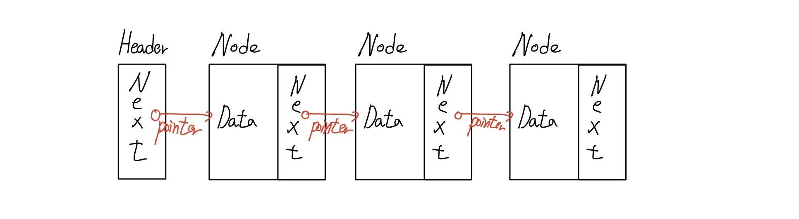

## 4주차 과제 : 연산자

#### 선택문 : switch

- 선택문은 조건문의 표현방법중 하나이다.

- if문은 어떠한 조건을 넣어주고 true/false에 따라서 실행하는 조건문이다. 하지만 switch문은 어떠한 변수에 대해서 그 변수가 어떤 값을 가지는지에 대해서 실행하는 조건문이다.

- ```java
  public class Main {
      public static void main(String[] args) {
          String test = "first";
          //test라는 변수에 대해서 switch
          switch(test){
              //test의 문자열이 fist일경
              case "first":
                  System.out.println("first!!");
                  //break라는 키워드를 사용해서 조건문에 대한 실행을 빠져나올 수 있다.
                  //만약 break문을 사용하지 않는다면 바로 그 다음 case문을 사용하게 된다.
                  break;
              case "end":
                  System.out.println("out");
                  //return을 사용하게 되면 메소드를 바로 return할 수 있다.
                  return;
              default:
                  //만약 test변수에 대해서 case문에 조건이 안적혀있을때는 default부분을 실행한다.
                  System.out.println("this is default");
  
          }
      }
  }
  
  ```

  

#### 반복문 : for, while

반복문은 반복되는 코드를 조건을 설정해서 조건만큼 원하는 코드를 반복시키는 명령문이다.

- for문 : 조건을 주고 조건을 검사 후, 조건이 참일경우 for문 안의 코드를 실행하고 다시 돌아가서 조건을 확인한다.

  - for문 안에서의 정의된 변수는 for문이 끝나게되면 메모리에서 소멸

  - 조건의 형태 :  (int i=0; i<5; i++)

    - 초기식 : i는 0으로부터 시작해서
    - 조건식 : i가 5보다 낮다면 for문 안의 코드를 실행하라(기준은 변수로 사용가능)
      - 만약 조건에 true값을 주게 되면 무한루프로 실행 가능
    - 증감식 :  i를 ++ 증가시킨다.

  - ```java
    public class Main {
        public static void main(String[] args) {
            for (int i = 0; i < 10; i++) {
              //i가 10미만일때 for문 안의 코드 사용
              //i를 하나씩 증가
                System.out.println(i);
            }
        }
    }
    
    ```

- while문 : 조건을 넣어주고 그 조건의 결과가 true일때 동안 계속 while문 안의 코드를 실행한다.

  - 내부의 코드를 전부 실행하고나서 조건을 다시 확인해서 조건문이 true인지 확인한다.

    - ```java
      public class Main {
          public static void main(String[] args) {
              int i=0;
              while(i<10){
                  //1. i이 10보다 낮을경우에는 안의 코드를 실행한다.
                  //4. i는 1이니까 10보다 낮고 다시 코드를 실행.....
                  System.out.println(i+"번째 코드실행");
                  i++;
                  //2. i의 값을 1로 변경
                  //3. 다시 while문으로 돌아가서 i값이 10보다 작은지 확인한다.
              }
          }
      }
      
      ```

  - 만약 true이게되면 계속해서 내부 코드를 실행한다. => 무한루프를 생성하기 좋은 반복문

  - ```java
    public class Main {
        public static void main(String[] args) {
            int i=0;
            //무한 루프이다. => 조건이 참일때이기 때문에 while문 안의 코드를 항상 실행
            while(true){
                System.out.println(i+"번째 실행");
                i++;
                if(i==3){
                    //루프를 돌고 있다면 해당 루프의 끝으로 진행하고 다음 루프로 넘어감 / continue이후의 문장은 실행되지 않는다.
                    continue;
                }
                if(i==5){
                    //루프를 돌고 있다면 해당 루프를 종료시키는 break
                    break;
                }
            }
        }
    }
    
    ```

  - 무한루프를 사용하게되면 꼭 무한루프에서 벗어나는 코드를 포함시켜줘야한다.

- do while문

  - 기본적인 사용은 while문과 비슷하지만 조건에 상관하지 않고 한 번은 꼭 실행을 해준다.

  - do에는 조건식의 결과가 참일 동안 반복할 코드

  - while에는 조건식을 넣어준다.

  - ```java
    public class Main {
        public static void main(String[] args) {
            int i=0;
            //while과 같은 식이지만 do/while방식으로 변경해서 사용가능
            do{
                System.out.println(i+"번째 실행");
                i++;
                if(i==3){
                    continue;
                }
                if(i==5){
                    break;
                }
            }while(false);
          //이렇게 조건식이 false여도 i가 0이라는 것을 print해주고 종료한다.
        }
    }
    
    ```


#### JUnit 5 : 자바 언어용 유닛 테스트 프레임워크

- Java를 위한 단위테스트(Unit Test) 프레임워크로 개발하는 프로그램에 대한 테스트 케이스를 쉽게 작성을 도와준다.
- JUnit 5 = JUnit Platform + JUnit Jupiter + JUnit Vintage
  - JUnit Platform : JavaVirtualMachine에서 테스트 프레임워크를 시작하기 위한 기초이며 플랫폼에서 실행되는 테스트 프레임워크를 개발하기 위한 TestEngine API를 정의한다.
  - JUnit Jupiter : JUnit 5에서 테스트 및 확장을 작성하기 위한 새로운 프로그래밍 모델과 확장 모델의 조합이다. Jupiter기반 테스트를 실행하기 위한 TestEngine을 제공해줌
  - JUnit Vintage : 플랫폼에서 JUnit3와 JUnit4를 실행하기 위한 TestEngine을 제공한다.


#### live-study 대시 보드를 만드는 코드를 작성하시오


#### LinkedList를 구현하세요

- 각 노드가 데이터와 포인터를 가지고 한 줄로 연결되어 있는 방식의 자료구조

- 각 노드에는 데이터가 들어가며 포인터는 이전노드의 포인터가 다음 노드의 포인터를 가리키는 방식이다



- LinkedList에 Node를 추가하거나 삭제하면 앞 뒤 링크만 변경되고 나머지 링크는 변경되지 않음
- 중간에 데이터를 추가/삭제 하게되면 전체의 인덱스가 한 칸씩 뒤로 밀리거나 당겨지는 일이 없기 때문에 데이터의 추가 / 삭제에 용이
- 인덱스가 없기 때문에 특정 요소를 찾기 위해서는 순차적으로 탐색해야 하기 때문에 탐색 속도가 떨어지는 단점이 있다.


구현

