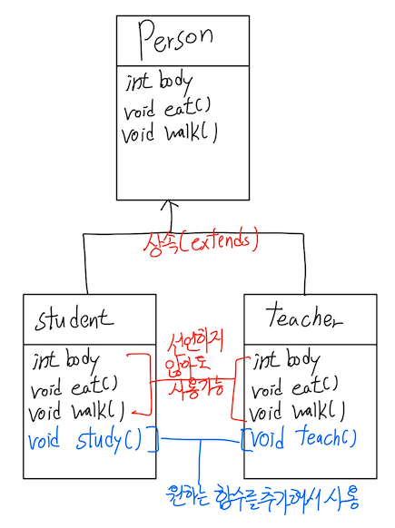

## 6주차 과제 : 상속


#### 상속이란?

- 부모 클래스에서 만들어진 필드와 메소드를 자식 클래스가 물려받아서 사용가능 하게 되는 것이다.

- 객체지향적으로는 부모의 특성을 자식이 물려받는 것

- 상속을 통해서 코드의 중복을 제거하고 클래스를 간결하게 구현할 수 있게 된다.
- 장점
  - 클래스의 간결화 - 멤버의 중복 작성 불필요
  - 클래스 관리 용이 - 클래스들의 계층적 분류
  - 소프트웨어의 생산성 향상 - 클래스 재사용과 확장 용이

- 

  - 위 그림을 보게되면 student클래스와 teacher클래스는 person이라는 클래스를 상속했기 때문에 body라는 변수, eat()함수, walk()함수를 공통적으로 사용할 수 있다. 
  - person이라는 함수를 따로 선언하고 상속받지 않았다면 student클래스와 teacher클래스에서 따로 공통된 변수와 메소드를 선언해줘야하고 이는 새로운 사람타입의 클래스를 생성할 때도 따로 새로운 함수에서 선언해줘야하는 불편함이 있다. => 코드 중복을 제거하고 코드를 간결하게 구현가능, 클래스의 재사용이 쉬워지고 클래스의 확장 또한 용이해진다.

- ```java
  public class Person {
      int body;
      void eat(){ System.out.println("Eating"); }
      void walk(){ System.out.println("Walking"); }
  }
  
  //extends키워드를 사용해서 상속을 구현한다
  class Student extends Person{
      void study(){
          System.out.println("Do Study!");
      }
  }
  
  class Teacher extends Person {
      void teach(){ System.out.println("Do Teach!"); }
  }
  
  public class Main {
      public static void main(String[] args) {
          Person p = new Person();
          p.eat();p.walk();
  
          //student은 person클래스를 상속받는 클래스이기 때문에 eat, walk함수를 사용할 수 있다.
          Student s = new Student();
          s.eat();s.walk();s.study();
  
          //teacher은 person클래스를 상속받는 클래스이기 때문에 eat, walk함수를 사용할 수 있다.
          Teacher t = new Teacher();
          t.eat();t.walk();t.teach();
  
      }
  }
  
  ```


#### 자바 상속의 특징

- 자바 상속의 특징
  - 자바에서는 클래스의 다중 상속을 지원하지 않는다.
    - 클래스를 여러 개 상속받는 다중 상속을 지원하지 않는다.
    - 상속의키워드인 extends뒤에는 단 하나의 클래스명을 지정할 수 있다.
  - 자바에서는 상속의 횟수에 제한을 두지 않는다.
  - 자바에서 계층 구조의 최상위에 java.lang.Object 클래스가 있다.
    - 자바에서 모든 클래스는 Object클래스를 자동으로 상속받도록 컴파일된다.
    - 만약 클래스2이 클래스1를 상속받는다고 했을때 컴파일시 클래스1을 상속받은 다음 컴파일이 끝나면 Object을 상속받는다.
    - Object 클래스는 유일하게 슈퍼클래스를 가지지 않는 클래스이다.


#### super 키워드

- 만약 오버라이딩을 한 뒤, 해당 메소드를 호출하게되면 오버라이딩한 메소드가 불리워지게 된다 => 밑에서 다시 자세하게 알아본다
- 위의 경우, 부모클래스의 원형 메소드를 호출할 때 사용하는 키워드가 super이게 된다.
- super키워드를 이용한다면 정적 바인딩을 통해서 슈퍼 클래스의 멤버에 접근할 수 있게 된다.
- super.멤버 / super.메소드
- this vs super
  - this와 super는 모두 레퍼런스로써 
    - this로는 현재 객체의 모든 멤버에 접근하게 되고, `this.객체 내의 멤버` 이렇게 사용한다.
    - super는 현재 객체 내에 있는 슈퍼 클래스 멤버를 접근하게 되고, `super.객체내의 슈퍼클래스의 멤버` 이렇게 사용한다.

+++super()에 대해서+++

- 부모클래스에서 접근지정자를 지정해서 자식에서 접근을 제한할 수 있다.
  - (접근 지정자 : 저번주에도 정리를 해봤다.)

  - public : 클래스내부, 동일패키지, 하위클래스, 그 밖의 영역에서 사용가능 / 상속받은 클래스들이 사용가능

  - protected : 클래스내부, 동일패키지, 하위클래스에서 사용가능 / 상속받은 클래스들이 사용이 가능하다

  - default : 따로 지정해주지 않는 경우이고 클래스내부, 동일패키지에서 사용가능

  - private : 클래스 내부에서만 사용가능 / 상속받은 자식클래스가 부모클래스를 사용할 수 없다

    =>부모클래스에서 protected, public으로 지정한 변수, 메소드를 자식이 사용할 수 있다.

- 자식 클래스의 생성자에서 부모 클래스의 생성자를 명시적으로 선택해줘야한다.
- 여기서 사용하는게 super() 함수이다
- super()는 부모 클래스의 생성자를 호출하는 코드이다
- 괄호안에 인자를 넣어서(super(10)) 슈퍼클래스의 생성자를 호출할 수도 있음

- 중요 : super()는 반드시 **생성자의 첫 라인** 에서만 사용되어야 한다.

```java
class Point {
    private int x, y;
    public Point(){
        this.x = 0;
        this.y = 0;
    }
    public Point(int x, int y){
      //4 - 이런 순서를 따라가게 된다.
        this.x = x;
        this.y = y;
    }
    public void showPoint(){
        System.out.println("("+x+","+y+")");
    }
}

class ColorPoint extends Point{
    private String color;
  //2 - 해당 객체의 생성자가 불리우고
    public ColorPoint(int x, int y, String color){
      //3 - super키워드가 불리워졌음
      //해당 객체의 부모 클래스의 생성자인 Point(x,y)를 호출
        super(x,y);
        this.color = color;
    }

    public void showColorPoint(){
        System.out.println(color);
        showPoint();
    }
}

public class SuperEx{
    public static void main(String[] args) {
      //1 - 메인에서 객체를 생성함
        ColorPoint cp = new ColorPoint(5, 6, "Blue");
        cp.showColorPoint();
    }
}

```

#### 메소드 오버라이딩

- 부모 클래스와 자식 클래스의 메소드 사이에서 발생하는 관계로서, 부모 클래스에 선언된 메소드와 같은 이름, 같은 리턴 타입, 같은 매개 변수 리스트를 갖는 메소드를 자식 클래스에서 재작성하는 것이다

- 간단히는 부모 클래스의 메소드 무시하기 / 덮어쓰기

- 같은 이름으로 다른 내용을 구현한다는 점에서 이는 객체 지향의 **다형성**을 만족시켜준다.

- 제약 사항

  - 부모 클래스의 메소드와 똑같이 작성해야한다.
    - 메소드의 이름, 동일한 매개변수 타입과 갯수, 동일한 리턴 타입을 가져야한다.
  - 부모 클래스 메소드의 접근지정자보다 접근의 범위를 좁힐 수 없다
    - public, protected, defult, private순서로 범위가 나뉘다.
    - 만약 protected일 경우, 오버라이딩하는 자식 클래스에서는 public이나 protected으로만 오버라이딩 할 수 있다.
    - *참고 : static이나 private 또는 final로 선언된 메소드는 자식 클래스에서 오버라이딩할 수 없다.

- 동적 바인딩(dynamic binding) : 오버라이딩된 메소드 호출

  - 실행할 메소드를 컴파일 단계에서 결정하지 않고 런타임시 결정하는 것을 의미함

  - ```java
    class Shape{
    	protected String name;
      //2 - 이 함수를 부르게 되고
      public void paint(){
        //3 - draw를 호출하는데 부모 클래스에 해당하는 4번 draw()가있고 5번 draw가 있는데 
        //2개 중에서 5번 draw함수를 호출하게 된다. => 동적 바인딩을 통해 오버라이딩 된 메소드를 실행한다.
        draw();
      }
      //4
      public void draw(){
        System.out.println("Shape");
      }
    }
    
    public class Circle extends Shape{
      //5
      @Override
      public void draw(){
        System.out.println("Circle");
      }
      public static void main(String [] args){
        Shape p = new Circle();
        //1 - 여기서 paint를 호출하게 되면 
        p.paint();
      }
    }
    ```

    => 어떤 경우에서든 자바에서 오버라이딩 된 메소드가 있다면 동적 바인딩을 통해 오버라이딩된 메소드가 무조건 실행된다.


#### 다이나믹 메소드 디스패치 (Dynamic Method Dispatch)

Method Dispatch : 어떤 메소드를 호출할지 결정하여 실제로 실행시키는 과정

종류로써는 dynamic, static타입이 존재한다

만약 컴파일 시, 호출할 메소드를 알 수 있다면 static / 런타임 시 호출할 메소드를 알 수 있다면 dynamic

Static Dispatch

```java
public class Dispatch{
	static class Service{
    //run 1
		void run(){
			System.out.println("run");
		}
    //run 2
		void run(String msg){
      System.out.println(msg);
    }
	}
  
  public static void main(String[] args){
    //실행하게되면 run 1나 run 2중 어느것을 실행된다는 것은 컴파일 시 알 수 있다.
    new Service().run();
  }
}
```

Dynamic Dispatch

```java
public class Dispatch{
	static abstract class Service{
    abstract void run();
  }
  static class MyService1 extends Service{
    @Override
    void run(){
      System.out.println("1");
    }
  }
  static class MyService2 extends Service{
    @Overide
    void run(){
      System.out.println("2");
    }
  }
  
  public static void main(String[] args){
    MyService svc = new MyService1();
    //어떤 클래스의 run메소드가 실행될 것인지는 컴파일 시 알 수 없다.
    svc.run();
  }
}
```

토비님 강의 : https://www.youtube.com/watch?v=s-tXAHub6vg

- 다이나믹 메소드 디스패치는 인터페이스를 이용해 참조함으로서 호출되는 메소드가 동적으로 결정되는 것을 의미함
- 인터페이스를 타입으로 메소드를 호출하고, 컴파일러는 타입에 대한 정보를 알고 있음으로 런타임시에 호출 객체를 확인해서 해당 객체의 메소드를 호출한다.
- 런타임에 참조되는 객체의 타입에 의존해 호출될 메소드를 결정하게 된다.


#### 추상 클래스


- 추상 클래스
- final 키워드
- Object 클래스