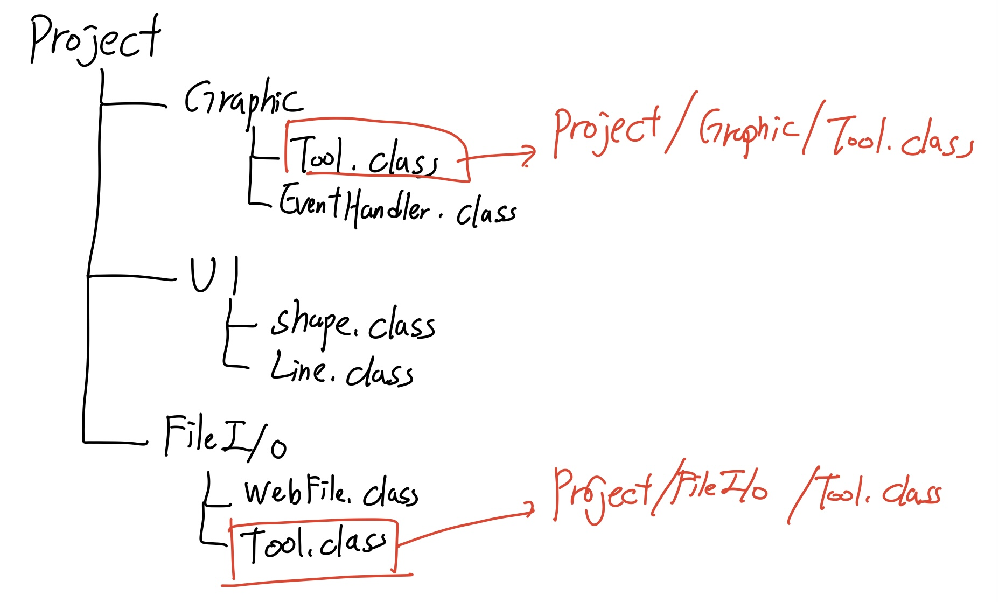
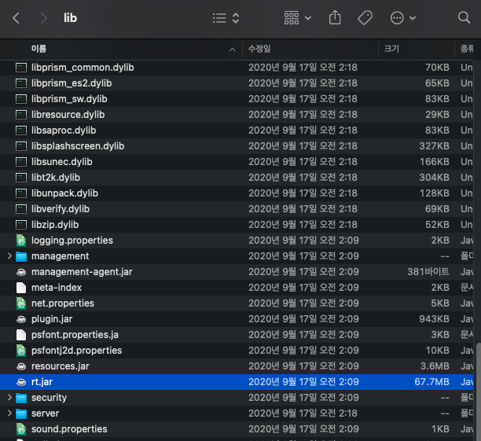

## 7주차 과제 : 패키지

#### package 키워드

자바에서 패키지란 서로 관련 있는 클래스나 인터페이스의 컴파일 된 클래스 파일 들을 한 곳에 묶어 둔 것이다. 

예를 들어서 프로젝트 하나에 FileIO작업, Graphic작업, UI작업이 있다고 가정을 해보면 이러한 형식으로 나눠서 사용할 수 있다

jdk는 개발자에게 많은 클래스 파일들을 패키지 형태로 제공한다 => 이 패키지들은 rt.jar 압축 파일로 제공된다

자바에서 제공하는 기본 패키지 : 자바 API라고 부르며 jdk를 설치한 디렉토리 밑의 rt.jar파일에 담겨 있다

자주 사용되는 패키지
- java.lang : 기본적인 클래스와 인터페이스를 제공하고, 자동으로 import 되어있다(import는 다음에서 설명)
- java.util : 날짜, 시간, 벡터, 해쉬맴 등 다양한 유틸리티 클래스와 인터페이스를 제공
- java.io : 키보드, 모니터, 파일 등의 입/출력 하는 클래스와 인터페이스를 제공
- java.awt, javax.swing : GUI프로그래밍에 필요한 클래스와 인터페이스를 제

#### import 키워드

응용프로그램에서 다른 패키지에 있는 클래스를 사용하고자 한다면 패키지 명을 포함하는 경로명을 사용해야 한다

이렇게 하게되면 컴파일러가 클래스 파일의 위치를 찾아서 가져다 주게 된다

- 클래스패스
- CLASSPATH 환경변수
- -classpath 옵션
- 접근지시자

