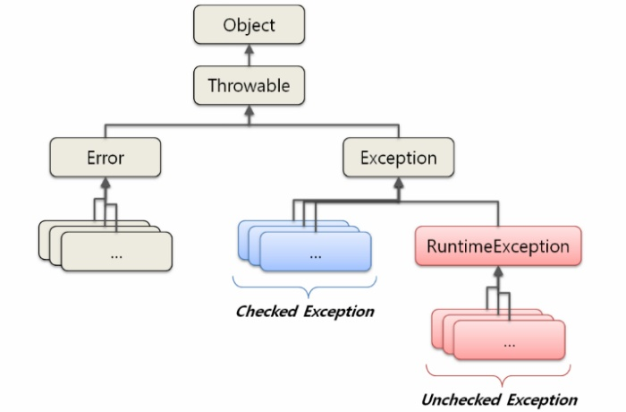

## 9주차 과제 : 예외처리

- RuntimeException과 RE가 아닌 것의 차이
- 커스텀한 예외 만드는 법


### Error란?

- 컴파일 시 문법적인 오류와 런 타임시 nullpoint와 같은 오류로 프로세스를 종료시킬 수 있는 것이다
- Error의 상황을 미리 방지하기 위해서 Exception 상황을 만드는 것


### Exception란?

- 오작동이나 결과에 악영향을 미칠 수 있는 실행 중 발생한 오류
- 사용자의 잘못된 입력이나 배열의 인덱스가 배열의 크기를 넘어가는 등 예기치 못한 상황에 의해 프로그램 실행중에 나타남

- 크게 2가지 종류가 있음
  - 컴파일 시점에 발생하는 예외 : Exception
    - 어느 곳에 문제가 있는지 컴파일러가 정확한 위치를 알려줌
  - 프로그램 실행 시에 발생하는 예외 : RuntimeException
    - 프로그램 실행 중에 발생되는 에러
    - 런타임 오류 메세지는 대부분 오류가 발생한 위치, 실행 중인 함수 같은 정보를 담고 있기도 함


### 예외 계층 구조



https://itmining.tistory.com/9에서 가져온 그림

이 그림은 예외 클래스의 구조이다

- 모든 클래스의 조상인 Object클래스를 상속받는 모습


### 예외 처리

---

예외 처리란, 개발자가 작성한 프로그램의 실행 중에 예외가 발생하면 이에 대응하는 것을 말함

#### try-catch-finally

```java
try{
	예외가 발생할 가능성이 있는 실행문(try블록)
}
catch(처리할 예외 타입 선언){
	예외 처리문(catch블록)
}
finally{
	예외 발생 여부와 상관없이 무조건 실행되는 문장(finally 블록)
}
```

- 예외가 발생할 가능성이 있는 실행문은 try{} 블록으로 묶고
- 예외 처리 코드는 catch{} 블록 내에 작성
  - catch() 괄호 안에는 처리하고자 하는 예외의 타입을 선언
  - catch{} 블록은 예외마다 하나씩 작성되어야 한다
- finally{} 블록은 생략해도 상관 없으며, 예외가 발생하든 않든 마지막에 반드시 실행됨

- try블록내의 코드가
  - 정상적인 경우 : 정상적인 코드를 실행한 후, finally를 실행
  - try블록에서 예외가 발생한 경우, 남은 실행문을 실행하지 않고 catch{} 블록의 예외 처리문으로 점프하여 실행 -> 타입과 일치하는 catch{}블록으로 점프

+다중 catch문

```
try{
	예외가 발생할 가능성이 있는 실행문
}
catch(IOException | RuntimeException exception){

}
```

jdk 1.7부터는 하나의 catch블럭에 |를 사용해서 여러가지 예외를 담을 수 있게 되었다

- 하지만 다중 catch블럭에서 처리하는 부모와 자식 관계에 있으면 부모 클래스 하나로 처리가 가능하기 때문에 컴파일 시 에러남


#### throw, thorws

---

둘다 예외를 던지는 개념이다

- throw :

  - 메소드내에서의 상위 블럭으로 예외를 던지는 것

  - 실제로 exception을 throw할 때 사용하는 키워드

  - 강제로 예외를 발생시키는 것

  - 프로그래머의 판단에 따른 처리

  - throw 예약어 뒤에는 java.lang.Throwable 클래스를 상속받는 자식 클래스의 객체를 지정해야 한다

  - ```java
    public static void main(String[] args){
    	try{
    		throw new Exception();
    	}catch(Exception e){
    		System.out.println(e);
    	}
    }
    ```

- throws 

  - 현재 메소드에서 상위 메소드로 예외를 던진다
  - 메소드나 생성자를 수행할 때 발생하는 exception을 선언할 때 사용하는 키워드
  - 예외를 전가하는 것
  - 예외를 자신이 처리하지 않고, 자신을 호출하는 메소드에게 책임을 전가
  - 메소드를 정의할 때 throws 예약어를 추가하면 그 메소드를 호출하는 곳에서 예외 처리를 해야 함
  - Function throws SomeException : function이 예외를 던진다
    - 그렇기 때문에 function을 사용/호출 하는 곳을 try블록으로 감싸줌

  - ```java
    class Test{
    	public static void f() throws ArithmeticException{
        int a = 0;
        a = 10 / a;
      }
      
      public static void main(String[] args){
        try{
          //여기서 f함수가 예외를 던지고
          Test.f(); 
        }catch(Exception e){
          System.out.println("main() 메소드가 예외를 잡아서 처리한다: "+e);
        }
      }
    }
    ```

    - 여기서 ArithmeticException은 자바에서 제공해주는 예외 관련 클래스이다
    - 모든 예외 관련 클래스들은 java.lang.Throwable클래스의 하위클래스이다
    - 자주 사용하는 멤버함수
      - public String getMessage() : Throwable오브젝트의 상세 메시지
      - public void printStackTrace() : Throw가능 오브젝트 및 그 백 트레이스를 표준 에러 스트림에 출력


### 참고

---

https://itmining.tistory.com/9

https://vitalholic.tistory.com/246

명품 JAVA Programming - 황기태 저

